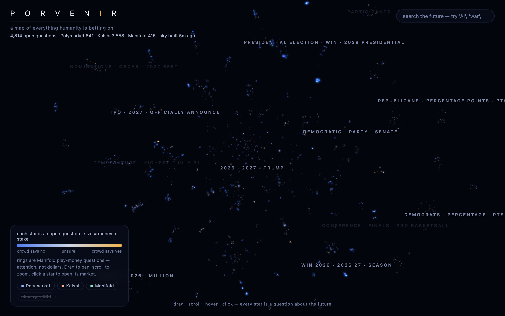

# porvenir

[](https://github.com/JP7599/porvenir/actions/workflows/ci.yml)
[](LICENSE)
[](https://jp7599.github.io/porvenir/)

A live map of everything humanity is betting on.

**See it: [jp7599.github.io/porvenir](https://jp7599.github.io/porvenir/)**



Every open binary market on Polymarket, Kalshi and Manifold — thousands of
questions about elections, wars, AI, rates, sport, weather, the end of the
world — fetched, embedded by meaning, and drawn as a navigable galaxy. Every
star is a question about the future. Its size is the money at stake, its
color is what the crowd currently believes, and questions about similar
things cluster into constellations named after their own vocabulary. Pan,
zoom, hover a star to read it, click through to the live market.

## Run it

The repo ships with a prebuilt `docs/data.json`, so the map works immediately:

```bash
cd docs && python3 -m http.server 8017   # then open http://localhost:8017
```

To rebuild the sky with fresh markets (takes a minute or two, most of it
t-SNE):

```bash
uv sync
uv run porvenir-build
```

## How the sky is made

1. Fetch open binary markets from the three venues' public APIs (no keys).
   Quality filters at the door: real quotes only, minimum liquidity or open
   interest, no parlay junk, no meta-markets.
2. TF-IDF over titles (uni+bigrams) → truncated SVD to 50 dimensions →
   t-SNE to the 2D plane. Semantic neighbors become spatial neighbors.
3. KMeans on the SVD space for constellations; each is named by its top
   TF-IDF terms, so the labels come from the markets themselves.
4. Everything is precomputed into one static JSON; the site is plain files.

The frontend is raw WebGL — no three.js, no libraries, no build step.
Additive-blended point sprites with a soft-disc glow, a spatial hash for
hover picking, wheel/drag navigation with inertia, and constellation labels
that fade in with zoom. Probability is a diverging color scale (blue = the
crowd says no, warm gold = the crowd says yes, pale = genuinely uncertain),
so belief is visible at a glance: settled questions glow in committed colors
at the edges of their clusters while the contested ones sit pale in the
middle.

## Honest notes

Manifold is play money; its stars are sized by mana liquidity, which is a
signal of attention, not dollars. Titles are what get embedded, so venues
that word the same event differently can land a small distance apart — that
is the interesting part. The map is a snapshot, not a feed; rebuild for a
fresh sky.

## Tests

```bash
uv run pytest        # parsers + pipeline on a synthetic corpus, no network
node docs/tests.mjs   # picking grid, color scale, projection math
```

MIT licensed.
